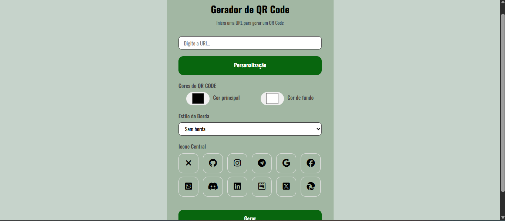

# Gerador de QR Code Personalizado

Aplicação web para **geração de QR Codes personalizados em tempo real**, permitindo ao usuário criar códigos a partir de URLs e customizar cores, bordas e ícones centrais. O projeto foca em usabilidade, interatividade e personalização visual.

** Acesse o projeto:** https://thaylanbf1.github.io/Gerador-de-QRCode/

---

##  Funcionalidades

- Geração de QR Code a partir de qualquer URL  
- Personalização de cores (principal e fundo)  
- Estilos de borda com efeito gradiente  
- Inserção de ícones centrais (redes sociais, etc.)  
- Download do QR Code em PNG e PDF  
- Layout totalmente responsivo  

---

##  Tecnologias Utilizadas

- HTML5  
- CSS3  
- JavaScript  
- QR Server API  
- jsPDF  
- Font Awesome  

---

##  Preview



---

## 🔧 Como executar o projeto localmente

```bash
# Clone o repositório
git clone https://github.com/thaylanbf1/Gerador-de-QRCode.git

# Acesse a pasta do projeto
cd Gerador-de-QRCode

# Abra o arquivo index.html no navegador
